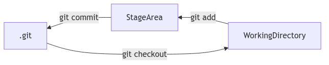

:PROPERTIES:
:CREATED:       2026-04-04T11:35:44+0800
:LAST_MODIFIED: 2026-04-06T21:35:25+0800
:END:
#+TITLE: Org-mode Syntax Test
#+AUTHOR: cnglen
#+AUTHOR: contributors
#+EMAIL: cnglen@gmail.com
#+FILETAGS: :emacs:org-mode:windancer:
#+HTML_HEAD: 
#+MACRO: color @@html:$2@@@@latex:\textcolor{$1}{$2}@@
#+MACRO: bgcolor @@html:$2@@@@latex:$2@@

An org-mode[fn:org-mode] document begins an optional */_zeroth_/* section (everything before the first heading), followed by a sequence of headings.

* DONE Introduciton

#+begin_quote
Any Org document is represented by a sequence of _elements_, that can recursively contain other _elements_ and/or _objects_.

From [[https://orgmode.org/worg/org-syntax.html#orgad766b8][org-syntax]]
#+end_quote

A general structure of org document may be:

#+begin_example
(org-data ...
 (zeroth-section ...
  (keyword ...)
  (paragraph ...)
  (drawer
   (paragraph ...)
   (pragraph (plain-text) (bold (plain-text)))))
 (heading
  (section (paragraph ...))
  (heading)
  (heading (section ...)))
 (heading))
#+end_example

#+begin_note
The *element* and *object* are two important concepts in the org-mode syntax.

You can:
- ignore them if you are an org-mode user
- if you are interested, see the [[https://orgmode.org/worg/org-syntax.html#orgad766b8][org-syntax]] for details.
#+end_note

* TODO Elements
:LOGBOOK:
- State "TODO"       from              [2026-04-04 Sat 18:02]
:END:

*{{{color(red, NOTE)}}}*: this part is not stable yet.

** Headings and Sections

*** DONE [#A] Heading test                                        :tag1:tag2:
SCHEDULED: <1999-03-31 Wed>
:PROPERTIES:
:CUSTOM_ID: heading-demo
:END:

This heading has a ​=DONE=​ keyword, a =[#A]= priority, a title ​=Heading test=​, and two tags ​=tag1=​ and ​=tag2=​.

Note this heading has a 'CUSTOM_ID' property set to "heading-demo", which can be linked by [[#heading-demo]].

**** h4

  This paragraph will not contain
  a long sequence of spaces before "a".

  This paragraph does not have leading spaces according to the parser.

  #+begin_src emacs-lisp
    (+ 1 2)    
  #+end_src

  The above source block preserves *two leading* spaces inside the code
  after removing the common indentation.

***** h5

a deep heading

****** h6

a very deep heading

**** h4 again

*** TODO [#A] COMMENT a commented heading

Since this heading is a *commented*,  it (including its childen headings) will *NOT* be exported by SSG.

****** Heading with level

This should not be shown in html, since its parent is a *commented* heading.

*** section test

This is a section. It includes everything from "This is" down to ​=**** h4=​, including the trailing blank lines.

#+begin_quote
Sections contain one or more non-heading elements. With the exception of the text before the first heading in a document (which is considered a section), sections only occur within headings.
#+end_quote

Sections do not include blank lines immediately following the parent
heading. It also means that headings containing only blank lines do
not contain any section.

**** h4

This is a section, too.

** Greater elements

*** Greater Block 
:PROPERTIES:
:CUSTOM_ID: greater_block_heading
:END:

#+begin_center
this is contents of a center block
#+end_center

#+begin_quote a b
this is contents of a quote block
#+end_quote

  #+begin_xxx
  this is contents of a special(xxx) block
  #+end_xxx

*** Drawer

The following drawer named d1's content will not appear in exported html.
:d1:
 this is the content of a drawer named d1, it will not appear in exported html.
 :end:

The following drawer is NOT a property drawer, since property drawer are attached to a *heading* or *inlinetask*, or in zeroth section. And its content will not appear in exported html.

:properties:
:foo: bar
:black: berry
:end:

*** TODO Dynamic block
:PROPERTIES:
:CUSTOM_ID: dynamic_block_heading
:END:
:LOGBOOK:
- State "TODO"       from              [2026-04-04 Sat 21:21]
:END:

*{{{color(red, NOT supported)}}}* now, since it depends on user emacs lisp function to auto update the contents.

#+begin_quote
Org supports _dynamic blocks_ in Org documents. They are inserted with
begin and end markers like any other code block, but the contents are
updated *automatically* by a *user function*.
#+end_quote

#+BEGIN: myblock :parameter1 value1 :parameter2 value2 ...
...
#+END:

*** Footnote Defintions

#+begin_quote
A footnote[fn:footnote_defintion] is started by a footnote marker in square brackets in column
0, no indentation allowed.  It ends at the next footnote definition,
headline, or after two consecutive empty lines.  The footnote reference
is simply the marker in square brackets, inside text.  Markers always
start with ‘fn:’.

From emacs manual [fn:emacs_manual]
#+end_quote

This is a *inline* footnote[fn:inline_footnote:yy], an inline definition of a footnote, which also specifies a name for the note.  Since Org allows multiple references to the same note, you can then use =[fn:inline_footnote]= to create additional references.

This is an *anonymous* footnote[fn::This is the inline definition of this footnotel].

The above inline footnote[fn:inline_footnote] is referenced again here.

The other footnote[fn:footnote_defintion] defintions of current file is
defined in [[#footnote-heading][the last heading]] named "Footnotes". One footnote defintion
can be referenced multiple times.

*** TODO Inlinetasks
:LOGBOOK:
- State "TODO"       from              [2026-04-04 Sat 21:46]
:END:

*{{{color(red, NOT supported)}}}* now

*** Items

See [[#plain_list_heading][plain list]] since items live in a plain list.

*** Plain lists
:PROPERTIES:
:custom_id: plain_list_heading
:END:

Test 1:
- item
- [@3] set to three, with attribue ​~id=3~​ in html
- [-] tag :: item contents
  * item, note whitespace in front

Test 2:
 1.  item 1
 2.      item 2

Test 3:
+ いいよ，こいよ
+ [@1] 伊已逝，吾亦逝
+ [@4] 意易失，吾亦逝
+ [@5] 逸一时，误一世
+ [@1] 疑一时，误一世
+ [@4] こめいじ　こいし

Test 4:
1) first item
   - 1.1.1
2) seoncd item whih a table and source code block
   | a   | b   |
   |-----+-----|
   | foo | bar |

   #+begin_src python
     print("hi")
   #+end_src

3) third item

**** unodered list

Write syntax test document [1/3]
- [X] introduciton
- [-] elements [1/3]
  - [ ] headings and sections
  - [-] greater elements [5/9]
    - [X] greater blocks
    - [X] drawers
    - [ ] dynamic blocks
    - [X] footnote defintion
    - [ ] inline task
    - [X] items
    - [ ] plain lists
    - [ ] property drawer
    - [X] table
  - [X] lesser element [0/0]
- [-] objects

Write a org parser and exporter
- write a parser
  * read syntax spec
  * write code
- write a exporter
  + SSG
  + pdf
     
**** descriptive list

- emacs :: An extensible, customizable, free/libre text editor — and more.
- vi :: a screen-oriented text editor originally created by Bill Joy in 1976 for the Unix operating system

**** ordered list

1) Open the fridge
2) Put the elephent into the fridge
3) Close the fridge

+ 打开冰箱
+ 把大象放入冰箱
+ 关闭冰箱

1. Ouvrir le réfrigérateur.
2. Mettre l'éléphant à l'intérieur.
3. Fermer le réfrigérateur.   

a. Den Kühlschrank öffnen.
b. Den Elefanten hineintun.
c. Den Kühlschrank schließen.

*** Property drawers
:PROPERTIES:
:foo:      bar
:key:      value
:END:

#+begin_quote
Property drawers are a special type of drawer containing properties attached to a *heading* or *inlinetask*. They are located right after a heading and its planning information, as shown below:
#+end_quote

*** Table

#+CAPTION[object in table]: table with objects
#+attr_html: :border 2 :rules all :frame border
| object kind           | object value                     | supported in table cell |
|-----------------------+----------------------------------+-------------------------|
| 01 text markup        | *bold*                           | y                       |
| 02 entity             | \alpha                           | y                       |
| 03 latex fragment     | $\sum_{i=1}^{n} i$               | y                       |
| 04 superscript        | a_1                              | y                       |
| 05 subscript          | c^{2}                            | y                       |
| 06 plain text         | just text                        | y                       |
| 07 footnote-reference | [fn:1]                           | y                       |
| 08 line-break         | \\                               | n                       |
| 09 timestamp          | <1234-07-31>                     | y                       |
| 10 macro              | {{{title}}}                      | y                       |
| 11 radio-target       | <<<radio target 011>>>           | y                       |
| 12 target             | <<target 012>>                   | y                       |
| 13 plain link         | https://foo.bar                  | y                       |
| 14 angle link         | <mailto:foo@bar>                 | y                       |
| 15 radio link         | radio target 011                 | y                       |
| 16 regular link       | [[target 012]]                       | y                       |
| 17 statistics-cookie  | NA                               | n                       |
| 18 inline-babel-call  | NA                               | n                       |
| 19 inline-src-block   | NA                               | n                       |
| 20 citation           | [cite:@key]                      | y                       |
| 21 export-snippet     | @@html:<b>@@bold text@@html:</b> | y                       |
| 22 table-cell         | NA                               | n                       |
| 23 citation-reference | NA                               | n                       |

#+CAPTION: table
| Name       | Phone | Age | as  |
| /          | <r10> | <l> | <c> |
|------------+-------+-----+-----|
| Peter Jack |   123 | 2   |  4  |
| Anna       | 54321 | 125 | 999 |

#+CAPTION: table with formula
| N | N^2 | N^3 | N^4 | sqrt(n) | sqrt[4](N) |
|---+-----+-----+-----+---------+------------|
| / |   < |     |   > |       < |          > |
| 1 |   1 |   1 |   1 |       1 |          1 |
| 2 |   4 |   8 |  16 |  1.4142 |     1.1892 |
| 3 |   9 |  27 |  81 |  1.7321 |     1.3161 |
#+TBLFM: $2=$1^2::$3=$1^3::$4=$1^4::$5=sqrt($1)::$6=sqrt(sqrt(($1)))

#+CAPTION: table with formulas
|   | x |    z |
|---+---+------|
| ! | x |   z1 |
| # | 1 |  300 |
| # | 6 | 1800 |
| # | 5 | 1500 |
#+tblfM: $3=$x*300
#+TBLFM: $3=$x*1

table cell with objects:

table cell's CONTENT can contain:
- minimal set of objects:
  - _plain text_
  - _text markup_
  - _entities_
  - _LaTeX fragments_
  - _superscripts_
  - _subscripts_
- citations, export snippets,
- footnote references
- links
- macros
- radio targets
- targets
- timestamps

  

  
** Lesser elements

*** Blocks

There are three kinds of blocks:
- [[#dynamic_block_heading][dynamic block]]
- [[#greater_block_heading][greater block]]
  - center
  - quote
  - any other value is a special block
- block (current section)
  - comment
  - example
  - verse
  - export
  - src

**** Comment Block    
#+begin_quote
Regions surrounded by ‘#+BEGIN_COMMENT’ ... ‘#+END_COMMENT’ are not exported.
#+end_quote

#+begin_comment
comment content
#+end_comment

**** Exampel Block

In example block, the exact formatting are preserved, including spaces.
#+begin_example
 example  content    contating       whitesaces       .
#+end_example

**** Verse Block
#+begin_verse
verse content
#+end_verse

**** Export block

Export block, where the export backend exports any code between any code bewteen begin and end markers.

    #+begin_export html
      hello org
    #+end_export

**** source code block

Source block of python:
#+begin_src python
  print("hello")

  def foo(s: int) -> int:
      s + 1
#+end_src

*** TODO Clock
:LOGBOOK:
- State "TODO"       from              [2026-04-06 Mon 20:12]
:END:

*{{{color(red, NOT supported)}}}* now

*** TODO Diary Sexp
:LOGBOOK:
- State "TODO"       from              [2026-04-06 Mon 20:12]
:END:

*{{{color(red, NOT supported)}}}* now

*** Planning

*** Comments

*** Fixed Witdh Area

*** Horizontal Rules

-----

-----

Horizontal must has at least 5 dashes: 

----

*** Keywords

#+key: value
#+KEY: VALUE
# #+call: not key word

*** Latex Environments

equation with number:

\begin{equation}  
\begin{split}
a=b+c
\end{split}
\end{equation}

equation without number:

\[
x = \sum_{i=1}^{n} i
\]

*** Node Properties

*** Paragraphs

Paragraphs are the default element, which means that any unrecognized
context is a paragraph.

Empty lines and other elements end paragraphs.

Paragraphs can contain the standard set of objects.

Drawer:
:d3:
a
:end:

block:
#+begin_SRC python
  print("hello")
#+end_src

comment:
# this is a comment

*** Table Rows

** test

A test:
- Item 1

- Item 2
  :drawer:
  inside item 2
  :end:

B test:
- a

- b

- c
  - c
    #+begin_src python
      print("xx")
    #+end_src

** fixed width
: This is a  
:
: fixed width area

** comment

# A “comment line” starts with a hash character (#) and either a whitespace character or the immediate end of the line.

# Comments consist of one or more consecutive comment lines.

  # Just a comment
  #
  # Over multiple lines

#

  
#a

* TODO Objects
:LOGBOOK:
- State "TODO"       from              [2026-04-04 Sat 18:03]
:END:

*{{{color(red, NOTE)}}}*: this part is not stable yet.

minimal set objects(6)

01 text-markup: *bold*, /italic/, _underline_, +strike-throught+, ​~code~, =verbatim=

02 entity: \alpha

03 latex-fragment: $\sum_{i=1}^{n}i$

04 suscripot: a_{i,j}

05 supscript: a^3

06 plain-text: text

standard set object(21)

07 footnote-reference: [fn:1]

08 line-break: \\

09 timestamp: <1234-07-31>

10 macro: {{{title}}}

11 radio-target: <<<radio target>>>

12 target: 
<<target>>

13-16 link: plain link https://foo.bar, angle link <mailto:foo@bar>, radio link radio target, regular link [[target]]

17 statistics-cookie: todo

18 inline-babel-call: todo

19 inline-src-block: todo

20 citation: todo

21 export-snippet: todo

other objects (2):

22 table-cell:
| foo |   | bar |

23 citation-reference: todo

** DONE Entity
CLOSED: [2025-10-22 Wed 11:37]
:LOGBOOK:
- State "DONE"       from "DOING"      [2025-10-22 Wed 11:37]
:END:

pattern1: ​=\NAME=​ This is a entity \alpha, and another entity \beta, and last \Delta

pattern2: ​=\NAME{}=​ without spaces \pi{}d.

pattern3: ​=\_SPACES=​

\_   3spaces
\_                    20spaces
\_                     21spaces, split into 20 space entity + one space.

** DONE Latex fragment
CLOSED: [2025-10-22 Wed 11:38]
:LOGBOOK:
- State "DONE"       from              [2025-10-22 Wed 11:38]
:END:

- ​=\NAME BRACKETS=​: \enlargethispage{2\baselineskip}
- ​=\(CONTENTS\)=​: \(\pi=3.1415\)
- ​=\[CONTENTS\]=​: \[\sum_{n=1}^{n}n = \frac{n(n+1)}{2}$$\]  
- ​=PRE$BORDER1 BODY BORDER2$POST=​: $a+b$
- ​=PRE$CHAR$POST=​: $a$, $\pi$
- ​=$$CONTENTS$$=​: $$\sum_{n=1}^{n}n = \frac{n(n+1)}{2}$$

let $a=2$, \(b=2\), $c$ is sum of $a$ and $b$, then
$$c=a+b=3$$
\[a-b=1\]

\enlargethispage{2\baselineskip}
\enlargethispage[2\baselineskip]

If $a^2=b$ and \( b=2 \), then the solution must be either $$ a=+\sqrt{2} $$ or \[ a=-\sqrt{2} \].

$$a$ bad fragment

** DONE Export snippet
CLOSED: [2026-01-13 Tue 11:06]
:LOGBOOK:
- State "DONE"       from              [2026-01-13 Tue 11:06]
:END:

​=@@html:@@not bold text@@html:</b>@@=​: @@html:@@not bold text@@html:</b>@@

​=@@html:<b>@@bold text@@html:</b>@@=​: @@html:<b>@@bold text@@html:</b>@@

​=@@beamer:some code@@ ignored in html backend=​: @@beamer:some code@@ ignored in html backend

** DONE Line break
CLOSED: [2026-01-13 Tue 11:04]
:LOGBOOK:
- State "DONE"       from              [2026-01-13 Tue 11:04]
:END:

First line\\
Second line

Not line break \\\
since PRE is backslash.

*** case1: detected

[[https:///baidu.com][baidu]]\\
second line

*** case2: detected

text\\
second line

*** case3: detected

text\\  
second line

text  \\  
second line

*** case4: NOT detected

a \\\
b

** DONE Macro
CLOSED: [2026-01-13 Tue 10:30]
:PROPERTIES:
:CUSTOM_ID: macro test
:END:
:LOGBOOK:
- State "DONE"       from              [2026-01-13 Tue 10:30]
:END:

| macro name        | arguments     | raw reference                                  | rendered value                                   | kind                                                 | supported |
|-------------------+---------------+------------------------------------------------+--------------------------------------------------+------------------------------------------------------+-----------|
| title             |               | ={{{title}}}=                                  | {{{title}}}                                      | keyword(title)                                       |           |
| author            |               | ={{{author}}}=                                 | {{{author}}}                                     | keyword(author)                                      |           |
| author            |               | ={{{author()}}}=                               | {{{author}}}                                     | keyword(author)                                      |           |
| email             |               | ={{{email}}}=                                  | {{{email}}}                                      | keyword(email)                                       |           |
| keyword           | NAME          | ={{{keyword(project)}}}=                       | {{{keyword(project)}}}                           | keyword(NAME)                                        |           |
| date              |               | ={{{date}}}=                                   | {{{date}}}                                       | keyword(date)                                        |           |
| date              | FORMAT        | ={{{date(%Y-%m-%dT%H:%M:%S%z)}}}=              | {{{date(%Y-%m-%dT%H:%M:%S%z)}}}                  | format keyword(DATE) if it's a signle timestamp      |           |
|-------------------+---------------+------------------------------------------------+--------------------------------------------------+------------------------------------------------------+-----------|
| time              | FORMAT        | ={{{time(%Y-%m-%dT%H:%M:%S%z)}}}=              | {{{time(%Y-%m-%dT%H:%M:%S%z)}}}                  | export time                                          |           |
| modification-time | FORMAT        | ={{{modification-time(%Y-%m-%dT%H:%M:%S%z)}}}= | {{{modification-time(%Y-%m-%dT%H:%M:%S%z)}}}     | modification time                                    |           |
|-------------------+---------------+------------------------------------------------+--------------------------------------------------+------------------------------------------------------+-----------|
| input-file        |               | ={{{input-file}}}=                             | {{{input-file}}}                                 | filename of the exported file                        |           |
|-------------------+---------------+------------------------------------------------+--------------------------------------------------+------------------------------------------------------+-----------|
| property          | PROPERTY_NAME | ={{{property(custom_id)}}}=                    | {{{property(custom_id)}}}                        | value of property PROPERTY_NAME in the current entry | No        |
|-------------------+---------------+------------------------------------------------+--------------------------------------------------+------------------------------------------------------+-----------|
| n                 |               | ={{{n}}}=                                      | {{{n}}}                                          | number of macro expanded: NOT supported              | No        |
|-------------------+---------------+------------------------------------------------+--------------------------------------------------+------------------------------------------------------+-----------|
| color             |               | ={{{color(red, red text)}}}=                   | {{{color(red, red text)}}}                       | by =#+macro:=                                        |           |
|-------------------+---------------+------------------------------------------------+--------------------------------------------------+------------------------------------------------------+-----------|
| results           | value         |                                                | src_python{print("hello")} {{{results(=None=)}}} | inline source block                                  |           |

{{{color(red, tow line
of red)}}}

** Link Test
:PROPERTIES:
:ID:       e30bb0f4-a323-4dce-8f6b-2f3b060e6dd0
:END:

regular link: with description [[https://www.baidu.com][baidu]]; without description [[https://foo.bar][foo_bar]]; description with objects [[http://foo.bar][\alpha *bold* $a+b$ foo]]; fuzzy internal [[target]]

plain link: https://plainlink.org https://foo(bar).org

angle link: <mailto:xx@xx.com> <https://foo(bar).org>

radio link: my radio target, define three radio target <<<*bold* target>>> and <<<my radio target>>>  and <<<\alpha>>> and <<<$\alpha$>>>, then we have *bold* target, my radio target, notmyradio target and $\alpha$ and \alpha.

#+name: Blossoming Swirls of Elegance
#+caption: This is a caption for the image linked below
#+caption: Blossoming Swirls of Elegance Free Vector Download
[[https://images.freeimages.com/image/previews/1b1/blossoming-swirls-of-elegance-5690563.jpg]]

*** image test

#+NAME: foo
#+begin_src mermaid :file ./image/test_demo_git.png :cache yes :exports results
  flowchart RL
    WD[WorkingDirectory] -- git add --> SA[StageArea] -- git commit --> Repo[.git]
    Repo --> |git checkout| WD
#+end_src

#+RESULTS[78e2508f51e4853e901b6e1aa28643594183cf32]: foo

** DONE timestamp
CLOSED: [2026-01-13 Tue 11:10]
:LOGBOOK:
- State "DONE"       from              [2026-01-13 Tue 11:10]
:END:

*** example
[2004-08-24 Tue]--[2004-08-26 Thu]

<2012-02-08 Wed 20:00 ++1d>

<2030-10-05 Sat +1m -3d>

*** p1
<1997-11-03>

<1997-11-03 Mon>

<1997-11-03 Mon 19:15>

<1997-11-03 Mon 19:15 +23d>

*** p2
<1997-11-03 Mon 19:15 +23d>--<1997-12-13>

<1997-11-03 Mon 19:15 +23d>--<1997-12-13 Mon>

<1997-11-03 Mon 19:15 +23d>--<1997-12-13 Mon 19:15>

<1997-11-03 Mon 19:15 +23d>--<1997-12-13 Mon 19:15 +23d>

<1997-11-03 19:15 +23d>--<1997-12-13>

<1997-11-03 +23d>--<1997-12-13 Mon>

<1997-11-03>--<1997-12-13 Mon 19:15>

<1997-11-03>--<1997-12-13 Mon 19:15 +23d>

<1997-11-03 19:15>--<1997-12-13 Mon 19:15 +23d>

<1997-11-03 Mon 19:15>--<1997-12-13 Mon 19:15 +23d>

<1997-11-03 Mon 19:15 +23d>--<1997-12-13 Mon 19:15 +23d>

*** p3
<1997-11-03 Mon 19:15-20:18 +23d>
  

** text-markup

*** basic test

a *bold*, a /italic/, a _underline_, a +strikethrough+, a ~code~, and a =verbatim= text

一个​*粗体*​、​/斜体/​、​_下划线_​、​+横划线+​、​~编程~​和​=字面=​文本

Not*bold* bad PRE

Not *bold*( bad POST

Not * bold* *bold * bad content

*** Nested test

a */bold-italic/* text

a *bold NOT/italic/* text

*/This text is bold and italic, _and this part is also underlined_./*

a */bold-italic/ *bold*

**** nested test

*/_bold-italic-underline_/*

*_/bold-underline-italic/_*

_/*underline-italic-bold*/_

_*/underline-bold-italic/*_

/_*italic-underline-bold*_/

/*_italic-bold-underline_*/

+/*_strikethrough-italic-bold-underline_*/+

+/_*strikethrough-italic-underline-bold*_/+

+/_*strikethrough-italic_*/+

*_~inner-most~_*

*_~=inner-most-include-equal=~_*

*_=~inner-most-include-tilde~=_*    

~=*_/inner-most-include-equal-star-underscore-slash/_*=~

 
未正确嵌套的处理，未定义:

 */abc/

 */abc/ _adf_

 */_abc/* bar_

 /*+/

 ** a **

 **a bold** : 2b

 ***a bold** : 2b
    
 ***a bold*** : 3b

***  object in markup

a *[[https://www.foo.org][foo]]* link

*** todo

a /i/ line

a ​*bold*​ line

b _*/underline-bold-italic/*_ line
c /_*italic-underline-bold*_/ line
d /*_italic-bold-underline_*/ line
e ~=*_/inner-most/_*=~ line

a *bold* line

a ~=*/bold_italic/*=~ line

中文​*bold*​测试

** superscript and subscript
*** superscript

simple

a^{34}

a^{(34)}

complex

a^{(34)+3}

a^{(385)+3}

a^{(385)+{a*b + (c/d) + a^{d}} + [d+e]}

a^{c+[d+e}

a^{c+(d+e}: bad

a^(c+4)

a^(c+4}: bad

complex with object

a^{foo *boldmarkup* bar}

a^{*boldmarkup*}

a^{*boldmarkup* foo \alpha}

a^{\alpha} 

a^(385+3 [[https://baidu.com][baidu]])

a^{385+3 [[https://baidu.com][baidu]]}

a single asterisk: b^*, ^^*, ,^*

an expression enclosed in curly brackets: a^{2}, a^{b{3}}, a^{b^{c}^{d}^{e}} (org-toggle-pretty-entities C-c C-x \)

sign(optional) chars final: foo^abc... a^+34, a^-12,889,,,,78.3\a, 10^24, 10^tau, 10^-12, 10^-tau, x^2-y^3, x^(2-i), x^{i^2}, a^2Kو b^(3+2),

b^[a]: bad

a^+aa,

*** subscript

a single asterisk: b_*, __*, ,_*

an expression enclosed in curly brackets: a_{2}, a_{b{3}}, a_{b_{c}_{d}_{e}} (org-toggle-pretty-entities C-c C-x \)

sign(optional) chars final: a_+34, a_-12,889,78.3\a, 10_24, 10_tau, 10_-12, 10_-tau, x_2-y_3, x_(2-i), x_{i_2}, a_2Kو b_(3+2),

** TODO inline source
:LOGBOOK:
- State "TODO"       from              [2026-01-09 Fri 22:26]
:END:

src_python{print("hello")} {{{results(=None=)}}}

src_cpp[:includes <iostream>]{std::cout<< "hi cpp" << std::endl;} {{{results(=hi cpp=)}}}

** target
<<<y>>>

<<y>>

<<yes a target>>

<<not a target   >>

<< not a target>>

<<not
a target>>

one item

<<target>>another item

Here we refer to item [[target][descript of target]]. (C-c C-o)

** radio target

define a radio target: <<<*bold* target>>>, reference a target *bold* target

** inline babel call

# call_NAME[HEADER1](ARGUMENTS)[HEADER2]
# call_NAME(ARGUMENTS)

** citation

[cite/style:common prefix ;prefix @key suffix; prefix @foo suffix ; common suffix]

[cite/a/f:c.f.;the very important @@atkey @ once;the crucial @baz vol. 3]

[cite:@key]

** TODO Footnote References
:LOGBOOK:
- State "TODO"       from              [2026-04-04 Sat 17:37]
:END:

This is a org [fn:org-mode] file, not not markdown[fn:md].

This is a inline footnote[fn:x:yy] and anonymous fn[fn::zz]. 

* Footnotes
:PROPERTIES:
:CUSTOM_ID: footnote-heading
:END:

[fn:org-mode] A GNU Emacs major mode for keeping notes, authoring documents, computational notebooks, literate programming, maintaining to-do lists, planning projects, and more — in a fast and effective plain text system.

[fn:footnote_defintion] A footnote is a reference, explanation, or comment placed at the bottom of a page, designated by a superscript number (e.g., 
) in the main text. They provide citations, background info, or copyright permissions without disrupting the text flow.

[fn:emacs_manual] In emacs, type <C-h i>, then search org-mode, or visit [[https://www.gnu.org/software/emacs/manual/emacs.html][emacs manual]]

[fn:1] org-mode is a text from emacs

[fn:md] markdown is another text file format

